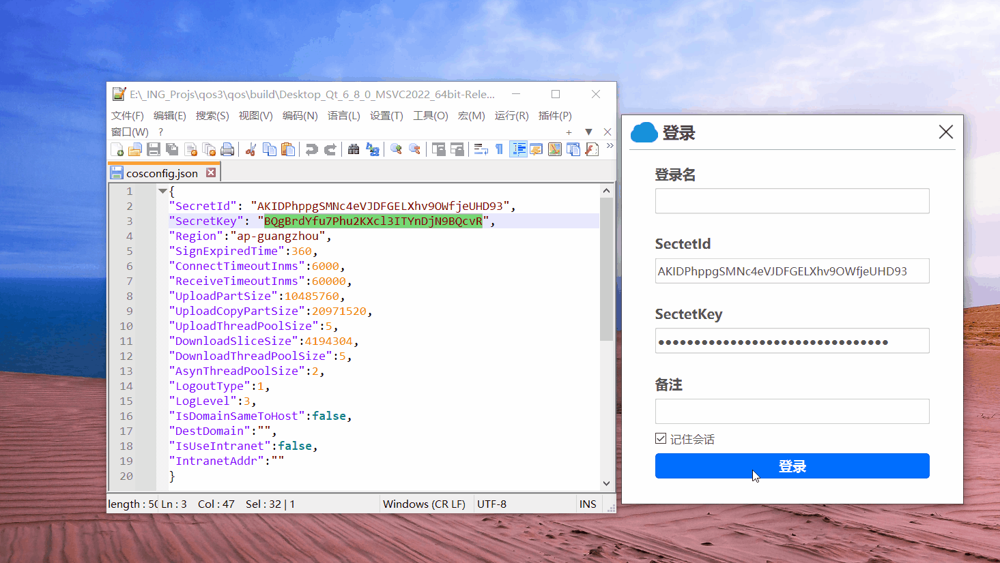
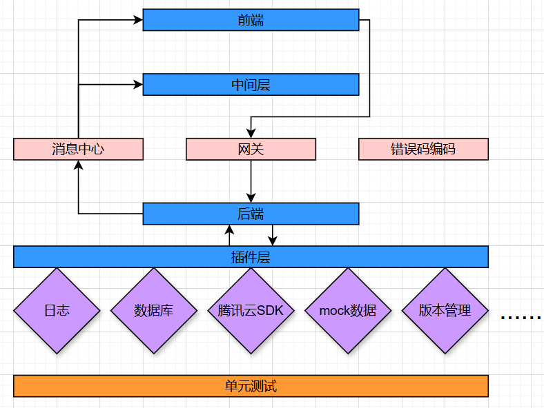

# qos：云对象存储浏览器
## 概述

该项目是一个基于 腾讯云SDK 的Qt客户端，采用了 插件式思想、信息编码思想、消息传播思想、前后端分离思想进行架构设计，增加了代码的可读性和可扩展性，并使用自定义控件、消息处理机制，Qss等技术实现了界面的美化和可靠的运行。

## 前置知识

需要了解下腾讯云对象存储服务器：[对象存储 快速入门-SDK 文档-文档中心-腾讯云 (tencent.com)](https://cloud.tencent.com/document/product/436/12301)；

## 环境配置

qt6 msvc2022

## 快速开始

下载exe安装包，安装并输入你的腾讯云对象存储服务器的SecretId、SecretKey即可。

## 技术点

1. 使用插件式思想，信息编码思想、消息传递思想、隔离思想，使得代码之间解耦，增加了可扩展性和可读性。
2. 使用了事件系统实现窗口的移动功能，禁用输入框的赋值粘贴快捷键，设置鼠标移动到按钮上时显示的形状等。
3. 使用MVC模式实现了面包屑导航功能，桶列表窗口等。
4. 使用QCompleter实现输入框自动补全功能，显示与输入内容匹配的下拉列表。
5. 使用单例模式，来管理日志、数据库、数据来源。
6. 通过sql拼接语句，实现数据库的增删改查，并解决了sql注入攻击。

## 模块划分

### 前端（fend）

1. **子模块（fend/uicom）**

    存放自定义通用控件。有独立于产品的通用主窗口、产品通用主窗口，面包屑导航控件、输入提示框、翻页按钮控件、进度条控件、自定义消息框、自定义输入提示框。

    > 实现了窗口最大最小化按钮的图标切换；可自定义增加按钮；调整窗口大小变化；面包屑导航功能；输入框自动补全功能；翻页功能；进度条功能；消息框相关功能；禁用输入框的赋值粘贴快捷键；设置鼠标移动到按钮上时显示的形状；设置视图代理；

2. **子模块（fend/uimain）**

    存主窗口相关控件。有主窗口；创建桶对话框；桶列表窗口；桶表格；对象表格；工具条；

3. **子模块（fend/uilogin）**

    登陆窗口。实现了登陆窗口相关信息

4. **子模块（fend/uitransfer）**

    上传窗口；下载窗口；传输窗口；

### 中间层（middle）

1. **子模块（middle/models）**

    定义了数据结构

2. **子模块（middle/signals）**

    定义许多信号

3. **子模块（middle）**

    全局单例类管理日志、数据库、数据来源。管理对象模型、桶模型。

### 后端（bend）

1. **子模块（bend/dao/clouds）**

    数据来源。有腾讯云SDK、mock数据 等

2. **子模块（bend/dao/configs）**

    版本管理

3. **子模块（bend/dao/dbs）**

    数据库

4. **子模块（bend/dao/logs）**

    日志

5. **子模块（bend/man）**

    管理数据来源，管理数据库

6. **子模块（bend）**

    网关

### 插件层（plugins）

1. **子模块（plugins）**

    安装数据来源和版本控制插件
