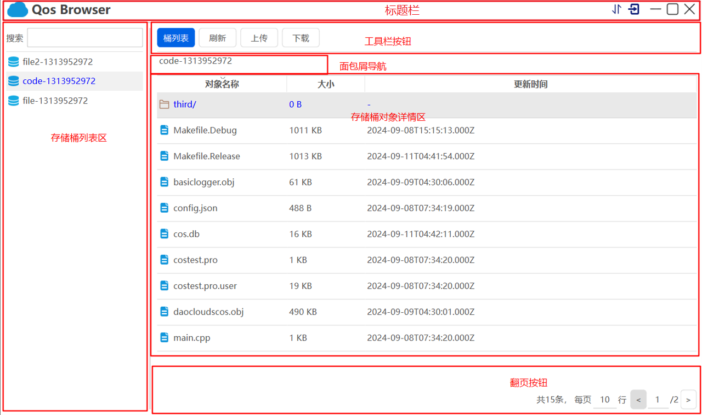

# 1 引言

## 1.1 背景

自2016年起，我司发布第一款对象存储云服务，至今用户量已达3500万。经调研发现，越来越多的用户需要有更专业服务，而作为用户入口的Web端能力有限，需要开发桌面版客户端以提供更高更专业的服务。与此同时，相关竞品已发布他们的客户端版本，而我司的客户端开发也必须迅速提上日程。

## 1.2 名词解释

| 序号 | 术语      | 描述                                                         | 备注 |
| ---- | --------- | ------------------------------------------------------------ | ---- |
| 1    | 对象存储  | 云厂商提供的一种存储海量文件的分布式存储服务，用户可将各种文件存储在云端英文：Qt Object Storage简称QOS |      |
| 2    | 对象      | 是QOS的基本单元，可理解为任何格式类型的数据，例如图片、文档和音视频文件等 |      |
| 3    | 存储桶    | 是对象的载体，可理解为存放对象的“容器”。一个存储桶可容纳无数个对象 |      |
| 4    | 地域      | 机房的分布地区，如上海，北京，广州，QOS的数据存放在这些地域的存储桶中。 |      |
| 5    | SecretId  | 用于访问对象的身份id                                         |      |
| 6    | SecretKey | 用于访问对象的身份秘钥                                       |      |

## 1.3 参考资料

腾讯云对象存储产品介绍：
https://cloud.tencent.com/document/product/436/6222

# 2 系统结构

## 2.1 整体结构

## 2.2 功能结构

# 3 需求详细介绍

## 3.1 登陆界面

### 3.1.1 原型图

1) 使用已经注册的对象存储账户，Secretld和SecretKey进行登录
2) 为方便用户下次登录，可将本次登录信息缓存，并以可读性更强的登录名进行缓存，在下次登录时可选择登录名登录

## 3.2 主界面

登录成功后，显示用户主界面

### 3.2.1 标题栏

1. 退出登录：退出到登录窗口
2. 传输列表：弹出传输列表视图，展示当前上传和下载进度

### 3.2.2 存储桶列表

1) 左侧列表项展示目前用户所有存储桶，右侧主区域展示存储桶详情
2) 支持搜索功能
3) 通过右键可删除存储桶
4) 双击存储桶名称，右侧主区域展示对象详情

### 3.2.3 右侧主区域

#### 3.2.2.1 存储桶/对象详情展示区

1) 存储桶列表详情：展示桶名称、区域、创建时间
2) 对象列表详情：文件名称、文件大小、修改时间
3) 目录结构可上钻（面包屑导航）和下钻（双击）
4) 目录结构变化，同步更新面包屑导航和翻页按钮

#### 3.2.2.2 面包屑导航

展示当前文件路径，并可快速切换其它目录

#### 3.2.2.3 翻页按钮

展示每页显示行数及翻页

#### 3.2.2.4 工具栏按钮

1) 创建桶：创建存储桶，处于桶详情页展示
2) 桶列表：展示桶详情，处于对象详情页展示
3) 刷新：刷新当前主界面，两个详情页都有
4) 上传：选择本地文件，上传至云端，处于对象详情页展示
5) 下载：选中一个对象，下载至本地，处于对象详情页展示

## 3.3 传输列表视图

1. 分别展示当前上传和下载进度
2. 进度：要有进度条显示，当前的上传或下载速度，剩余时间

